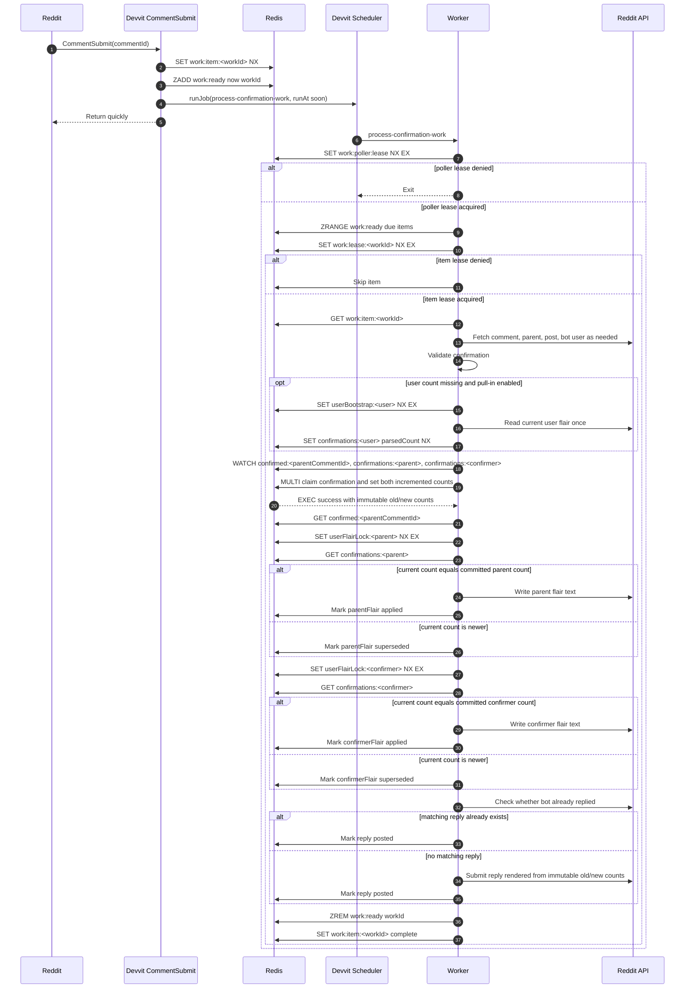

# Durable Confirmation Workflow Plan

## Goal

Rewrite confirmation processing around a Redis-backed durable work queue and state machine.

Redis is the source of truth for trade counts and confirmation state. Reddit flair text is not read during normal confirmation processing. The only permitted flair read is a controlled "pull in missing user" workflow for a user with no Redis count yet; after that read, Redis is updated and becomes authoritative for that user.

The Devvit app should be treated as short-lived event and scheduler invocations. It should never require a single invocation to run to completion for correctness.

## Core Properties

- `CommentSubmit` and rescan paths enqueue work; they do not directly mutate user counts or write flair.
- A scheduled worker polls Redis for due work and advances each item one durable step at a time.
- Count commits are atomic for both users and the confirmation claim.
- Reddit writes are at-least-once side effects guarded by persisted effect state and idempotency checks.
- Replies describe the immutable transition caused by that specific confirmation, even if Redis counts have since advanced.
- Flair writes use current Redis count as a guard so stale work never writes a lower flair over a newer count.

## Redis Keys

```text
work:ready
  Sorted set. member = workId, score = nextAttemptAt epoch millis.

work:item:<workId>
  Temporary JSON work item with event metadata, status, attempts, nextAttemptAt, and lastError.
  Deleted after terminal completion.

work:processed:<workId>
  Persistent terminal marker for a processed comment work item. This is the durable
  idempotency flag used by event and rescan enqueue paths after work:item:<workId>
  has been cleaned up.

work:poller:lease
  Short TTL global worker lease. Prevents overlapping pollers from doing substantial work.

work:lease:<workId>
  Short TTL item lease. Prevents concurrent processing of the same work item.

confirmed:<parentCommentId>
  Canonical confirmation claim. During processing this is the rich immutable count
  transition and effect recovery record. After all terminal effects complete, it is
  compacted to a small confirmed marker that still prevents double-counting.

rejected:<commentId>
  Temporary rejection reply recovery record. Deleted after the rejection reaches a
  terminal processed state.

confirmations:<usernameLower>
  Authoritative trade count for the user.

userFlairLock:<subredditLower>:<usernameLower>
  Existing per-user flair write lock.

userBootstrap:<subredditLower>:<usernameLower>
  Optional guard for the controlled missing-user pull-in workflow.
```

## Work Item Shape

```ts
interface ConfirmationWorkItem {
  workId: string
  kind: 'confirmation-comment'
  commentId: string
  postId: string
  subredditName: string
  enqueuedAt: string
  status: 'queued' | 'failed'
  attempts: number
  nextAttemptAt: number
  lastError?: string
}
```

The work item stores immutable event facts only. It must not store pre-read user counts from enqueue time because queue latency could make them stale before processing.

Items remain `queued` while leased. `work:lease:<workId>` is the running marker; this keeps recovery simple because abandoned work can resume after the lease expires without repairing a stuck `running` status.

When work reaches a terminal state, the worker writes `work:processed:<workId>` and then deletes `work:item:<workId>` and `work:lease:<workId>`. The processed marker persists; the full queue item does not.

## Confirmation Claim Shape

```ts
interface ConfirmationClaimRecord {
  commentId: string
  replyToCommentId: string
  parentCommentId: string
  subredditName: string
  parentAuthor: string
  confirmer: string
  modApproval: boolean

  parentPreviousCount: number
  parentCount: number
  confirmerPreviousCount: number
  confirmerCount: number

  effects: {
    parentFlair: EffectState
    confirmerFlair: EffectState
    reply: EffectState
  }

  createdAt: string
  updatedAt: string
}

type EffectState =
  | { status: 'pending' }
  | { status: 'applied'; at: string }
  | { status: 'posted'; at: string; replyId?: string }
  | { status: 'superseded'; at: string; currentCount: number }
  | { status: 'failed'; at: string; error: string; attempts: number }
```

`parentPreviousCount`, `parentCount`, `confirmerPreviousCount`, and `confirmerCount` are immutable after the Redis transaction commits. Reply rendering must use these values, not the current Redis count at recovery time.

The rich claim record is only required until both flair writes and the reply effect are terminal. After the worker writes the persistent processed marker for the triggering comment, `confirmed:<parentCommentId>` is compacted to a small marker containing the winning confirmation comment id, parent comment id, subreddit, post id, and confirmed timestamp.

## Sequence Diagram



## Worker Cadence

Target cadence: 30 checks per minute, using a two-second poll interval if Devvit production scheduler supports that safely.

The worker must still be bounded:

```ts
const WORKER_BUDGET_MS = 20_000
const WORKER_POLL_INTERVAL_MS = 2_000
const POLLER_LEASE_TTL_MS = 30_000
const ITEM_LEASE_TTL_MS = 45_000
const MAX_ITEMS_PER_RUN = 5
```

If a worker fails before explicitly requeueing, the item remains in `work:ready`; once `work:lease:<workId>` expires, a later poller can resume it. Explicit requeue is an optimization, not the recovery guarantee.

## Step Wrapper

Use a small durability helper for pure-ish workflow steps:

```ts
async function runStep<T>(
  ctx: WorkflowContext,
  claimKey: string,
  stepName: string,
  run: () => Promise<T>,
): Promise<T>
```

Behavior:

- If the step is already recorded complete, return the recorded result.
- If not complete, run it.
- Persist the output or effect status before moving to the next step.
- For external Reddit writes, the step must include an idempotency check before writing.

This is not deterministic Temporal replay. It is persisted step completion plus idempotent side effects.

## Processing Rules

### Enqueue

- `CommentSubmit` creates `workId = confirmation-comment:<commentId>`.
- Enqueue uses `SET work:item:<workId> ... NX` so duplicate events collapse.
- Rescan can enqueue the same workId without duplicating work.
- Manual approval should likely enqueue a different kind, for example `manual-confirmation:<commentId>`.

### Validation

- The worker fetches current Reddit objects needed to validate the event.
- Invalid confirmations are marked complete with a rejection reply effect if needed.
- Old-thread, self-confirmation, and already-confirmed replies should use the same durable reply effect pattern.

### Count Commit

- Count commit uses Redis `WATCH` over:
  - `confirmed:<parentCommentId>`
  - `confirmations:<parentAuthorLower>`
  - `confirmations:<confirmerLower>`
- If `confirmed:<parentCommentId>` exists for the same triggering comment, replay the stored transition.
- If it exists for another triggering comment, this work is complete with already-confirmed behavior.
- Missing Redis counts are handled by policy:
  - If pull-in is enabled, run the controlled bootstrap workflow once.
  - Otherwise use `0`.
- Commit both users' new counts and the confirmation claim in one transaction.

### Flair Effects

- Flair text is only written.
- Before writing a committed flair, read current Redis count.
- If current Redis count is greater than the committed count, mark the effect `superseded` and do not write.
- If current Redis count equals the committed count, write the exact committed flair text.
- If current Redis count is lower, treat that as inconsistent state and fail/retry or dead-letter.

### Reply Effect

- Reply text is rendered from immutable committed transition fields.
- Before submitting, fetch replies to the target comment and check for any reply authored by the bot user.
- If found, mark posted.
- If not found, submit and mark posted.

## Missing User Pull-In

This is the only permitted Reddit flair read.

Implemented policy:

- Automatic pull-in: if a confirmation participant has no `confirmations:<user>` key, the worker reads that user's current flair once, writes the parsed count into Redis with `NX`, and then commits the confirmation from that count.
- If there is no parseable flair count, the missing Redis count is treated as `0`.
- Reddit flair text is never used after the Redis count exists.
- There is no bulk flair import path. Bulk import can race with a still-running legacy bot and corrupt Redis source-of-truth assumptions. Existing users are pulled in one at a time only when they first participate in a processed confirmation.

## Implementation Phases

1. Add plan and agree on open questions.
2. Add Redis queue primitives and tests:
   - enqueue
   - due item listing
   - global poller lease
   - item lease
   - backoff
3. Add scheduler job:
   - `process-confirmation-work`
   - optional event-side nudge with a Redis guard so only one near-term worker is scheduled
4. Convert `CommentSubmit` and rescan to enqueue-only paths.
5. Move confirmation validation and count commit into the worker.
6. Add durable effect tracking for flair writes and replies.
7. Add reply dedupe by bot-authored replies on the target comment.
8. Add missing-user pull-in workflow according to the chosen policy.
9. Convert manual approval into queued work.
10. Add admin visibility:
    - list pending work
    - retry failed work
    - dead-letter after repeated failure
11. Remove old direct-processing paths once tests cover the new workflow.

## Implementation Decisions

1. Missing-user pull-in happens automatically during confirmation processing.
2. Successful and rejection replies do not include internal idempotency markers; recovery dedupes by finding an existing reply from the bot account on the target comment.
3. The worker uses a two-second recurring schedule plus debounced near-term nudges from enqueue paths; rescan runs hourly.
4. Repeated failure dead-letters work into `work:failed`; moderators can view queue status and retry failed work from menu actions.
5. Manual trade-count adjustments remain direct moderator actions because they are explicit corrections, but they still update Redis before writing flair.
6. Already-confirmed, self-confirmation, and old-thread replies use persisted rejection records and bot-author dedupe.
7. Terminal work keeps only compact idempotency markers. Full work items, rich confirmation effect state, and rejection records are temporary recovery state and are cleaned up after successful terminal completion.
8. Bulk flair import is intentionally omitted. Missing Redis counts are handled only by the per-user fallback pull-in path.
